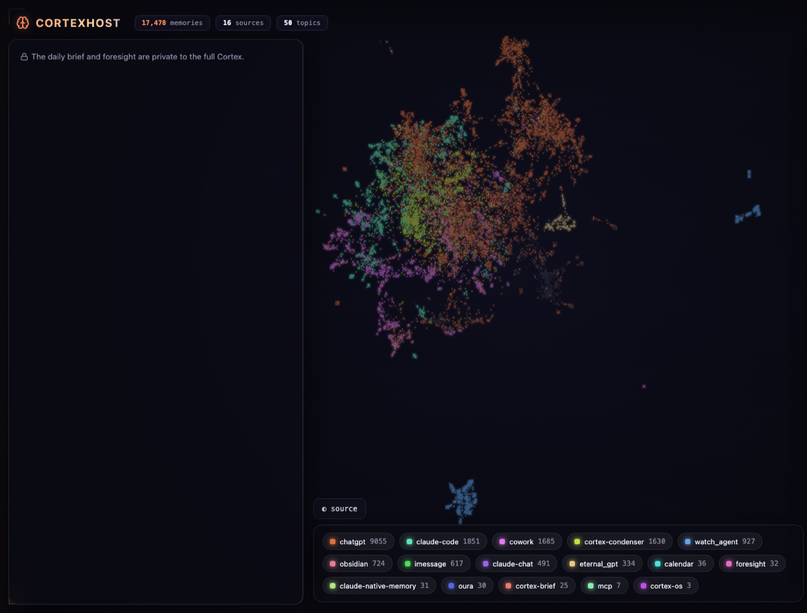
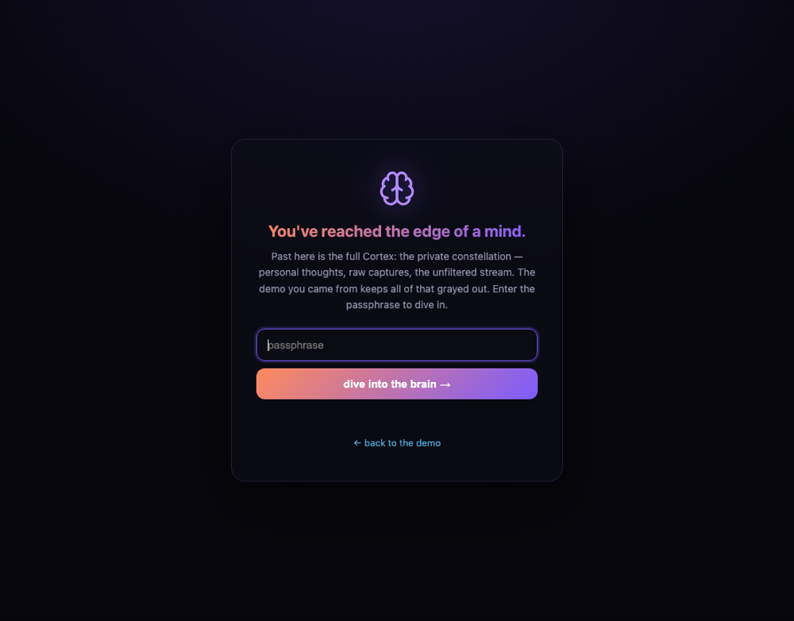

# CortexHost

A self-hosted second brain: every surface you think on feeds one private
memory substrate, and everything downstream — recall inside your AI chats, a
daily brief, behavioral foresight, a galaxy map of your mind — reads from it.

Context compounds. Chats forget, notes fragment, and the connective tissue of
your thinking dies in the gaps. Cortex captures the durable layer (decisions,
frameworks, facts, preferences, lessons) from every source, condenses it into
one-sentence "sparks," embeds them into a vector store you own, and serves
them back through MCP to whatever AI you already use.



```
 capture            condense              store            reflect
 ─────────          ─────────            ─────────         ─────────
 ChatGPT export ─┐                                     ┌─ MCP tools (search,
 Claude Code   ──┤   LLM distiller       Qdrant        │   store, todos) in
 sessions        ├─► "sparks" with   ──► vectors +  ───┤   Claude / any client
 Obsidian      ──┤   dedupe keys         payloads      ├─ daily brief + email
 anything      ──┘   (two-zone           (yours)       ├─ foresight forecasts
                      privacy filter)                  └─ galaxy map + demo
```

## What you get

- **MCP memory server** — `search_memory`, `store_memory`, `recent_memories`,
  `memory_stats`, plus a lightweight operating layer (`add_todo`,
  `add_commitment`, `whats_open`, `daily_brief`). Connect it to Claude,
  ChatGPT, or any MCP client and your AI remembers you.
- **Daily brief** — every morning, an LLM reads what actually crossed your
  brain in the last day (excluding its own past output) and reports the
  *delta*: what changed, open loops, suggested focus. Honest on quiet days.
  Optional email push.
- **Foresight** — weekly, it scores its own prior forecasts against reality,
  then forecasts which of your threads are at risk of going dark, with
  calibrated probabilities and one highest-leverage action.
- **Galaxy map** — every memory as a point in a pan/zoom constellation
  (UMAP + KMeans topics), colored by source or topic, with a live feed.
  Includes a **shareable demo**: an LLM classifies each memory
  personal-vs-public, grays and strips the personal ones, and serves the
  redacted view on its own secret URL with a styled password gate to the
  full map.

  

## Install with an AI agent (recommended)

This repo is agent-ready: [AGENTS.md](AGENTS.md) is a full runbook (steps,
verification, failure modes) that Claude Code, Cursor, and most coding agents
read automatically. So the easiest install is:

```bash
git clone https://github.com/jeffnich/CortexHost && cd CortexHost
claude   # or open the folder in Cursor
```

and say: **"Set up Cortex for me — follow AGENTS.md."** The agent runs
`./setup.sh`, verifies every service, connects itself to your new memory
server over MCP, and walks you through importing your ChatGPT history. You
supply exactly one thing: your OpenAI API key.

## Quickstart (manual)

```bash
git clone https://github.com/jeffnich/CortexHost && cd CortexHost
./setup.sh    # scaffolds .env, generates secrets, boots the stack, verifies
./verify.sh   # re-check health any time
```

Then:

- MCP endpoint: `http://localhost:8300/<CORTEX_MCP_PATH_SECRET>/mcp`
  (streamable HTTP — add it to Claude as a custom connector / MCP server)
- Brief: `http://localhost:8301/<BRIEF_PATH_SECRET>/brief.html`
- Map: `http://localhost:8302/<MAP_PATH_SECRET>/map.html`
- Shareable demo: `http://localhost:8302/<DEMO_PATH_SECRET>/demo.html`

Import your history (this is what makes it feel alive on day one):

```bash
pip install -r services/mcp/requirements.txt openai python-dotenv
# ChatGPT: Settings -> Data controls -> Export, put conversations.json in uploads/
python3 capture/distill_chatgpt_export.py --execute
# Claude Code sessions:
python3 capture/backfill_claude_sessions.py --execute
# Obsidian (set OBSIDIAN_VAULT + OBSIDIAN_INCLUDE first):
python3 capture/ingest_obsidian.py --execute
```

See [docs/capture-setup.md](docs/capture-setup.md) for ongoing auto-capture
(Claude Code session hooks, scheduled Obsidian sync).

## Privacy model

- **You host everything.** The corpus lives in your Qdrant volume; nothing is
  shared with anyone but your LLM provider (OpenAI for embeddings +
  distillation).
- **Two-zone capture.** The distiller prompt excludes secrets and
  employer-proprietary content at ingest time, and `CORTEX_EXCLUDE` lets you
  extend the exclusion list. Work content stays siloed; only the personal
  layer crosses.
- **Capability URLs.** Every service hides behind an unguessable path secret.
  The demo map lives on its own secret so sharing it never exposes the full
  map's URL, and the full map can additionally be password-gated.
- **Raw text never leaves the substrate un-redacted.** The shareable demo
  strips personal memory text from the page entirely (server-side), not
  hidden client-side.

## Architecture notes

- One Qdrant collection (`memories`), 1536-dim cosine
  (`text-embedding-3-small`). Every memory: text, source, tags, timestamps,
  scoped `tenant:user` id, content-hash dedupe key (idempotent re-runs), and
  a 0.97-cosine near-duplicate guard.
- Services are dependency-light Python (stdlib HTTP; no frameworks). The map
  regenerates in a child process so the always-on server stays ~40MB.
- Runs anywhere Docker runs. On Railway (what the original deployment uses),
  point the services at a private-network Qdrant and keep the same env vars.

## What it costs

- **Self-hosted**: the stack itself is free (Docker on your machine). A small
  cloud box or Railway-style deploy runs ~$5-10/month.
- **OpenAI usage**: embeddings are fractions of a cent per thousand memories;
  the daily brief + weekly foresight cost pennies a day on `gpt-5-mini`. The
  one real line item is the one-time distill of a big ChatGPT export — a few
  dollars for hundreds of conversations. Set `BRIEF_MODEL`/`BACKFILL_MODEL`
  to trade quality vs cost.

## Updating, backing up, uninstalling

```bash
git pull && docker compose up -d --build      # update
docker compose down                            # stop (data persists)
docker compose down -v                         # UNINSTALL - deletes your memories
```

Your brain lives in the `qdrant_data` Docker volume. Back it up cold with
`docker run --rm -v <project>_qdrant_data:/data -v "$PWD":/b alpine tar czf
/b/cortex-backup.tgz /data` (find `<project>` via `docker volume ls`), or use
Qdrant's snapshot API while running.

## Lineage & roadmap

Extracted from a private personal deployment (no history carried over). The
private lineage also captures iMessage (via a macOS Full-Disk-Access
snapshot trick), Apple Calendar patterns, and Oura biometrics — those rails
are macOS-specific and not in this cut yet. PRs welcome; this is shared as a
working reference system, not a supported product.

## License

MIT
